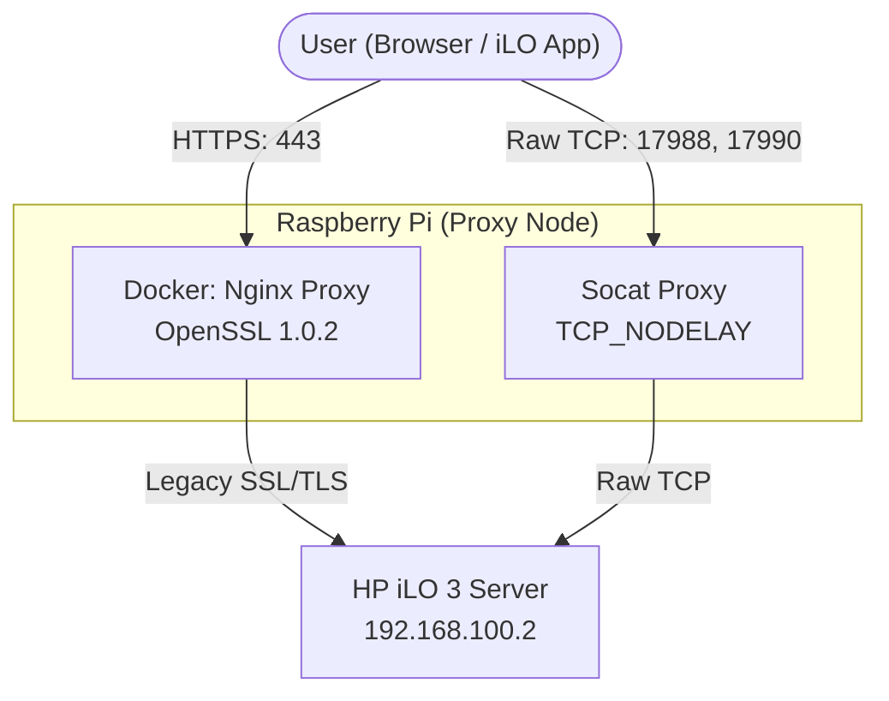

# iLO 3 Proxy Fix for Modern OS

[](README.vi.md)

A robust reverse proxy solution designed to revive legacy HP Integrated Lights-Out 3 (iLO 3) remote management on modern operating systems and modern browsers. 

## The Problem
HP iLO 3 uses extremely outdated security protocols (SSLv3, RC4, TLS 1.0) and proprietary KVM implementations. 
- **Modern Browsers/OS:** Completely drop support for these ciphers, resulting in `502 Bad Gateway` (when proxying) or `ERR_SSL_VERSION_OR_CIPHER_MISMATCH` directly in the browser.
- **HP iLO Standalone App:** When connecting directly from Windows 10/11, Schannel restricts the old encryption, leading to `The request was aborted: Could not create SSL/TLS secure channel` or a silent Black Screen.
- **Nginx Reverse Proxies:** Attempting to proxy the video KVM port using Nginx stream modules usually results in Nagle's algorithm dropping keystrokes (keyboard not working).

## The Solution
This solution consists of two components running on a lightweight intermediate machine (like a Raspberry Pi):
1. **Dockerized Ubuntu 16.04 + Nginx:** Provides an older OpenSSL 1.0.2 environment capable of handshaking with the iLO. It proxies ports 80/443 and actively rewrites the XML payloads using `sub_filter` to force the iLO client apps to route through our proxy.
2. **Socat (Layer 4 Proxy):** Bypasses Nginx buffering entirely to provide a zero-delay `TCP_NODELAY` direct tunnel for the proprietary iLO KVM ports (17988, 17990, 27910), fixing the keyboard issues.

### Architecture



## Quick Start Installation

1. Clone this repository on your proxy machine (e.g., Raspberry Pi).
2. Open `install.sh` and edit your IP addresses:
   ```bash
   ILO_IP="192.168.100.2" # Your physical iLO IP
   PROXY_IP="192.168.100.7" # Your Raspberry Pi IP
   ```
3. Run the installer as root:
   ```bash
   sudo ./install.sh
   ```

## Usage

- **Web Management:** Open your modern browser and go to `http://<PROXY_IP>`
- **Virtual Console / KVM:** Download the [HPE iLO Integrated Remote Console (Standalone)](https://downloads.hpe.com/pub/softlib2/software1/pubsw-windows/p390407056/v138774/Setup.exe) (or use the backup `Setup.exe` provided in the `tools/` folder of this repository in case the official link goes down), open it, and type `<PROXY_IP>` in the address bar. (Accept the self-signed certificate warning if prompted).

> [!TIP]
> If you boot into ESXi or an OS and your keyboard stops working while the screen still updates, verify your iLO licensing. iLO 3 Standard limits KVM keyboard input to POST/BIOS only. You need an "iLO Advanced" license for full OS control.
