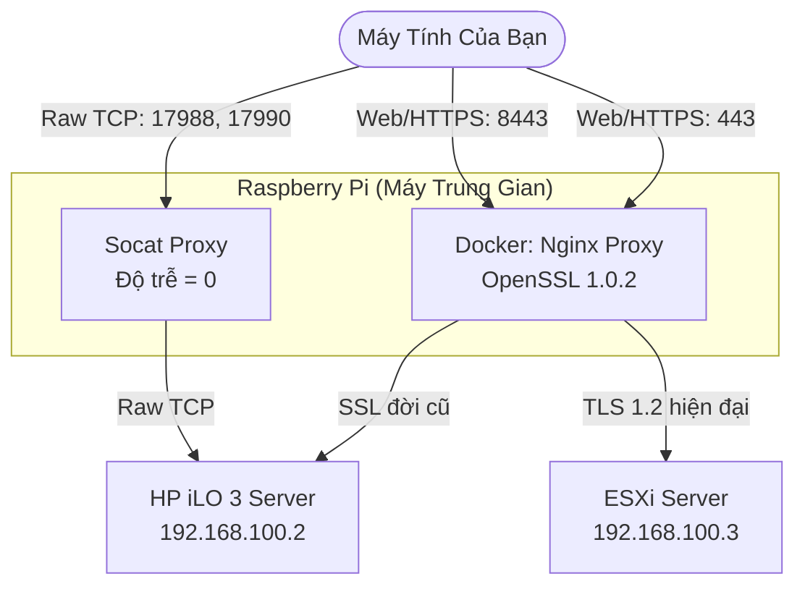

# Giải Pháp Hồi Sinh HP iLO 3 Cũ Kỹ

[](README.md)

Đây là một giải pháp thiết lập Reverse Proxy (Máy chủ trung gian) chuyên dụng để "hồi sinh" khả năng điều khiển từ xa của các máy chủ HP dùng iLO 3, giúp chúng có thể truy cập mượt mà từ các hệ điều hành và trình duyệt đời mới (Windows 10/11, Chrome, Edge).

## Vấn Đề Gặp Phải
HP iLO 3 sử dụng các giao thức bảo mật đã quá lỗi thời (như SSLv3, mã hóa RC4, TLS 1.0) cùng với cấu trúc truyền màn hình (KVM) độc quyền.
- **Trên trình duyệt / OS hiện đại:** Hệ điều hành Windows 10/11 tự động từ chối giao tiếp với các mã hóa yếu này. Khi dùng proxy thông thường sẽ gặp lỗi `502 Bad Gateway`, còn khi truy cập trực tiếp sẽ gặp lỗi SSL.
- **Trên phần mềm HPE iLO Standalone:** Do Windows chặn lớp bảo mật Schannel bên dưới, ứng dụng văng lỗi `Could not create SSL/TLS secure channel` hoặc bị "màn hình đen" do không bắt tay được.
- **Liệt bàn phím qua Nginx Proxy:** Nếu bạn cố proxy các cổng KVM bằng Nginx, thuật toán Nagle (gom gói tin) của proxy sẽ khiến các gói dữ liệu bàn phím bị giữ lại, dẫn đến màn hình lên nhưng không gõ phím được.

## Cách Hoạt Động
Giải pháp này yêu cầu một máy tính nhỏ gọn làm trung gian (như Raspberry Pi hoặc máy ảo Linux) và chạy 2 dịch vụ song song:
1. **Dockerized Nginx trên Ubuntu 16.04:** Giả lập môi trường cũ (chứa OpenSSL 1.0.2) để có thể "bắt tay" SSL với iLO. Nginx proxy cổng Web 80/443 và dùng `sub_filter` để tự động sửa IP gốc bên trong gói dữ liệu, "lừa" phần mềm iLO kết nối qua máy Proxy.
2. **Socat (Layer 4 Proxy):** Một "ống nước" tinh khiết dùng để luân chuyển dữ liệu thô (Raw TCP) của Video/Bàn phím/Chuột/Đĩa ảo (cổng 17988, 17990, 27910) với tùy chọn `TCP_NODELAY`, loại bỏ hoàn toàn độ trễ giúp khắc phục triệt để lỗi liệt bàn phím.

### Sơ Đồ Kiến Trúc



## Hướng Dẫn Cài Đặt Nhanh

1. Clone repo này về máy Proxy của bạn (ví dụ: Raspberry Pi).
2. Chỉnh sửa file `install.sh` và điền IP của bạn:
   ```bash
   ILO_IP="192.168.100.2" # IP thật của iLO
   PROXY_IP="192.168.100.7" # IP của Raspberry Pi
   ```
3. Chạy script cài đặt với quyền root:
   ```bash
   sudo ./install.sh
   ```

## Cách Sử Dụng

- **Quản lý qua Web:** Mở Chrome/Edge và truy cập `http://<PROXY_IP>`
- **Quản lý ESXi (Cổng phụ):** Truy cập giao diện quản lý máy ảo ESXi an toàn qua cổng `https://<PROXY_IP>:8443`
- **Sử dụng Màn Hình Điều Khiển (KVM) / Cài Win:** Tải phần mềm [HPE iLO Integrated Remote Console (Standalone)](https://downloads.hpe.com/pub/softlib2/software1/pubsw-windows/p390407056/v138774/Setup.exe) (hoặc sử dụng file `Setup.exe` dự phòng đã được đính kèm sẵn trong thư mục `tools/` của repo này phòng trường hợp link tải của HP bị hỏng), mở lên và nhập `<PROXY_IP>` vào ô IP. (Bấm Accept nếu có cảnh báo chứng chỉ số).

> [!TIP]
> Nếu bạn vào ESXi mà bàn phím lại bị liệt (trong khi màn hình vẫn chạy), hãy kiểm tra lại bản quyền iLO. HP iLO 3 bản "Standard" chỉ cho gõ phím ở màn hình đen BIOS. Bạn cần nạp key bản quyền "iLO Advanced" thì mới gõ phím được bên trong hệ điều hành nhé!
